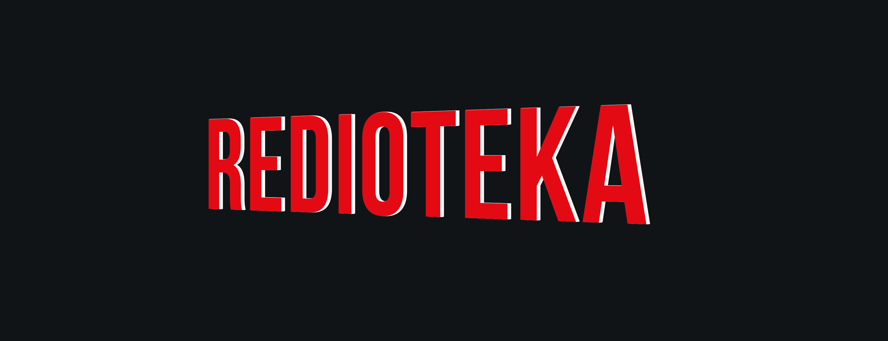
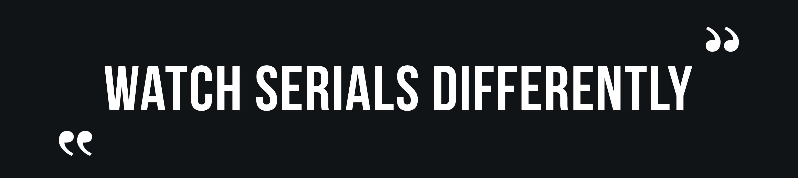

  

## Описание

Redioteka — это стриминговый сервис, позволяющий смотреть интересующие фильмы и сериалы зарегистрированным пользователям. 
У всех пользователей есть возможность оформить подписку на интересующий их контент. 
А также оставлять оценки, подбирать фильмы и сериалы по жанрам и актерам.

Здесь вы можете с легкостью оформить подпику на контент, 
который подохдит именно вам, чтобы не пропустить новые видео!

**Чем мы лучше?** 
<ol> 
  <li>Вы можете смотреть подборки фильмов и сериалов друзей</li>
  <li>У нас есть система ачивок!</li>
</ol>

  

## Демо

[redioteka.com](https://www.netflix.com/ru/)

## Программные решения

**Frontend:** JavaScript, node.js, npm

**Backend:** Golang, PosgreSQL

## Как запустить проект

To be continued...

## API

To be continued...

## Команда 
- Фуллстек
    - [Григорий Будкин](https://github.com/GregoryBS)
    - [Никита Волков](https://github.com/VolkovNik)
    - [Антон Тимонин](https://github.com/timoninas)
    - [Павел Чеклин](https://github.com/paulnopaul)

## Менторы
- Фронтенд
    - [Елизавета Добрянская](https://github.com/Betchika99)
- Бэкенд
    - [Екатерина Кириллова](https://github.com/K1ola)

## Репозиторий фронтенда

[github.com/frontend-park-mail-ru/2021_1_RedTech](https://github.com/frontend-park-mail-ru/2021_1_RedTech)

